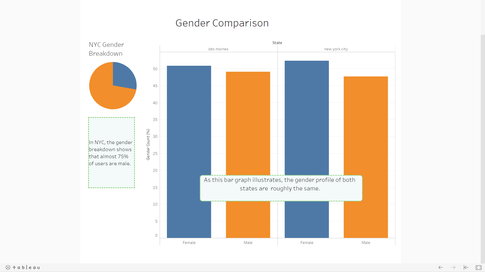
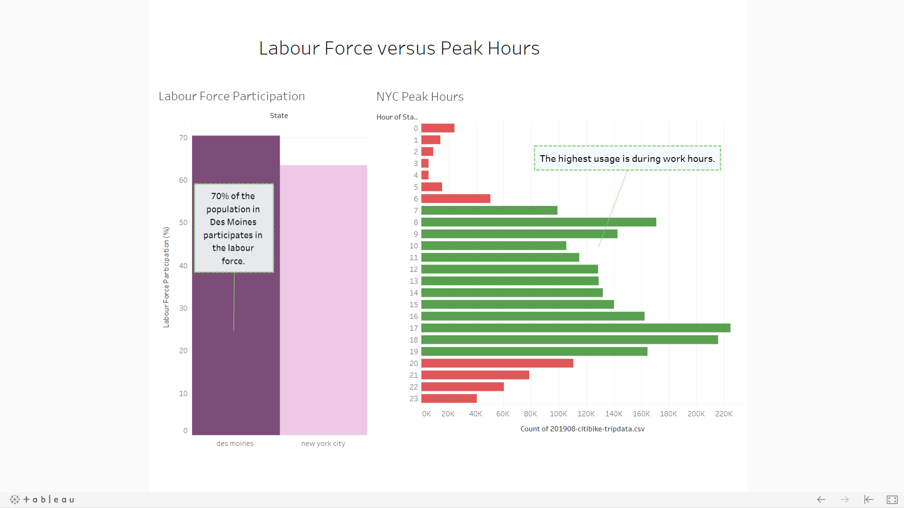
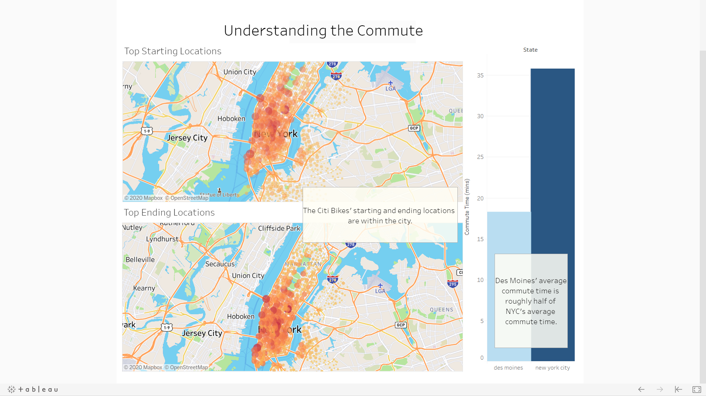
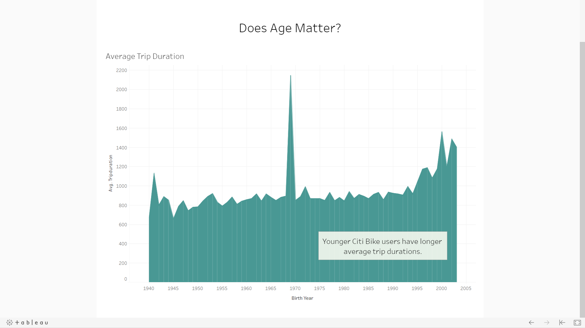

# bikesharing

## Objectives

Using the Citi Bike data, we looked into answering the following questions about New York City.

1. Who uses them?
2. Where are the bikes mostly used?
3. What time of the day are the bikes mostly used?
4. How long are the bikes being used for?

## Resources 

  - Data Source: 201908-citibike-tripdata.csv.zip, nyc_desmoines_population_data.csv
  - Software: Visual Studio Code 1.43.0, Tableau Desktop 2020.2.0

## Summary

# If sharing bike will be successful

By looking at the Citi Bike's data, it is easy to identify the bike-sharing program is quite successful in NYC . Using this data, we realized that we can expand this program to another state such as Des Moines, Iowa. At a first glance, New York City and Des Moines seem to be completely different from each other; however, doing some research, we were able to conclude that starting a bike-sharing program in Des Moines may prove to be fruitful.

Throughout our analysis, we wanted to answer the following questions:

1. What is the population of Des Moines?
2. How does its population compare to the population of New York City?
3. Does the population affect the number of people who will use the bike-sharing program?

## Population Comparison

We first looked at the population size of both New York City and Des Moines. As we see below (and page one of the Tableau Story), [New York City has a population of 8,336,817 and Des Moines has a population of 214,237][1]. New York City is about 39 times larger than Des Moines. 

With 13,983 bikes in New York City, the bikes were used 2,344,224 times in the month of August in 2019 [2]. If we broke down the numbers, there is 1 Citi Bike for around every 596 people in New York City. If we used the same ratio with Des Moines, we would roughly need 360 bikes to start a bike-sharing program. As such, the start-up cost would be a lot less as opposed to starting a bike-sharing program within a state comparable to New York City.

## Gender Comparison

Though we looked at the population, there are a few more questions that need answering, such gender. Does gender play a role in the usage of these bike-sharing programs. If we take a look at the pie graph, it displays the gender breakdown for the Citi Bikes. It shows that almost 75% of users in New York City were male. Looking over the bar graph, we have displayed the gender profile of both states. The graph illustrates that the gender profile of both states are roughly the same. [1] 

## Labour Force versus Peak Hours

Looking at the gender distribution is a great way to see who will use the bikes, but another way to add to our argument is looking at the when the bikes are heavily used in New York City. Looking at the *NYC Peak Hours*, we are able to identify that majority of the bikes were used during work hours. It shows that many people in New York City use the bike-sharing program to get to and from work. Being ranked 4th as *Most Congested City in the Country*, [3] a main reason for this is because New York City is extremely busy and packed with cars. As a result, it would be faster to travel around the city with a bike.

In New York City, 63.5% of the population are participating within the labour force and in Des Moines, 70.3% participate in the labour force. [4] [5] If we put the two together, we can assume that there will be people in Des Moines who could use a bike to commute to work instead of other means of transportation.

## Understanding the Commute

We have displayed 2 maps illustrating the starting and ending locations of the Citi Bikes in New York City. As you can see, the larger and darker the circle, the higher the count. As well, majority are within the city. Our data also shows that in New York City, the average commute time is 35.8 minutes and in Des Moines an average of 18.3 minutes. [6] [7] A reason as to why Des Moines has such a low average could be because of something called land area. Des Moines spans over [88 square miles][4] which is 3.4 times smaller than the land area in [New York City][5]. This makes it possible for bikes to be a means of transportation.

## Does Age Matter?

Another factor we can look at is if age has any correlation to who will use the bikes. As we see in this graph, all age groups uses the Citi Bikes in New York City. However, we see that younger users have longer average trip durations. This is further evident with the graph that shows majority of the bikes are used by individuals in the labour force.

## Conclusion

The data we have illustrated presents a compelling story for Des Moines. Though Des Moines does not have the population size of New York City, the gender profile, average commute time and labour force participation provides similarities between the two states. On top of that, there is a lower start-up cost because Des Moines is smaller in size and requires fewer bikes than a state like New York City.

Not only will people in the labour force use the bikes to get to and from work, but Des Moines have many attractions for tourists to visit. They have many wonderful events and they "[have more than 800 miles of biking trails][8]". As a result, not only would citizens use the bike-sharing program, but also tourists who visit Des Moines.

As well, what better way to promote bike-sharing as a means of transportation than promoting it alongside with improving one's health? In *County Health Rankings and Roadmaps*, the data shows that Des Moines has 32% adult obesity as opposed to New York City who has half of that amount at 15%. [9] Introducing the bike-sharing program can promote a healthy lifestyle for the citizens living in Des Moines and reduce the percentage of adult obesity. 

## References

1. https://www.census.gov/quickfacts/fact/table/newyorkcitynewyork,desmoinescityiowa/BZA010217 

[1]: https://www.census.gov/quickfacts/fact/table/newyorkcitynewyork,desmoinescityiowa/BZA010217 

2. https://www.citibikenyc.com/system-data

[2]: https://www.citibikenyc.com/system-data

3. https://inrix.com/scorecard-city/?city=New%20York%20City%2C%20NY&index=14

[3]: https://inrix.com/scorecard-city/?city=New%20York%20City%2C%20NY&index=14

4. https://worldpopulationreview.com/us-cities/des-moines-population/

[4]: https://worldpopulationreview.com/us-cities/des-moines-population/

5. https://worldpopulationreview.com/us-cities/new-york-city-population/

[5]: https://worldpopulationreview.com/us-cities/new-york-city-population/

6. https://datausa.io/profile/geo/new-york-northern-new-jersey-long-island-ny-nj-pa-metro-area

[6]: https://datausa.io/profile/geo/new-york-northern-new-jersey-long-island-ny-nj-pa-metro-area

7. https://datausa.io/profile/geo/des-moines-ia

[7]: https://datausa.io/profile/geo/des-moines-ia

8. https://www.catchdesmoines.com/things-to-do/

[8]: https://www.catchdesmoines.com/things-to-do/

9. https://www.countyhealthrankings.org/app/iowa/2020/compare/snapshot?counties=19_095%2B36_061

[9]: https://www.countyhealthrankings.org/app/iowa/2020/compare/snapshot?counties=19_095%2B36_061

## Usage

**Note:** Please ensure you have all the required and updated softwares on your computer.

  1. Download the following files for the project.
  
      - Bike Sharing Proposal.twbx
      - nyc_desmoines_population_data.csv
      - 201908-citibike-tripdata.csv (https://www.citibikenyc.com/system-data, then click "downloadable files of Citi Bike trip data", and then look for the filename that matches this CSV file)

  2. Open the Bike Sharing Proposal file and create your own visualiztions.
